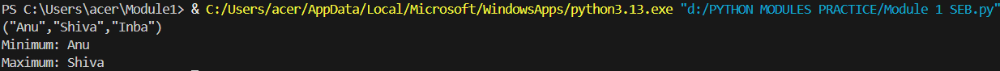

# EX NO 3(a)
## 🎯 Aim
To write a python program to check whether an entered string is a palindrome or not without using built-in functions Available in Python

## 🧠 Algorithm
1. Get the string as input.
2. Reverse the string 
3. Check whether the original string and the reversed string are the same

## 💻 Program
```
a=input()
b=a[::-1]
if(a==b):
    print("The entered string is palindrome")
else:
    print("The entered string is not palindrome")
```

## Output


## Result
Thus a python program to write a python program to check whether an entered string is a palindrome or not has been written and executed successfully.


# EX NO 3(b)
## 🎯 Aim
To find a match for a string using regular expression

## 🧠 Algorithm
1. Get an input string from the user
2. find the match for the string using findall()
3. Print the matched string

## 💻 Program
```
import re
a=input()
b=re.findall(r"wood+\w*",a)
print(b)
```

## Output


## Result
Thus a python program to find a match for a string using regular expression has been written and executed successfully.


# EX NO 3(c)
## 🎯 Aim
To write a Python program to sum all the items in a list

## 🧠 Algorithm
1. Define a variable sum and initialize it to 0.
2. Traverse all elements of the list using for loop.
3. Print the sum of the elements of the list.


## 💻 Program
```
list1=[1,2,-8]
sum=0
for i in list1:
    sum+=i
print(sum)

```

## Output


## Result
Thus a python program to find the sum all the items in a list has been written and executed successfully.


# EX NO 3(d)
## 🎯 Aim
To write a python program to create the tuple by the multiples of 3 up to N and the print sum of the elements of the list.

## 🧠 Algorithm
1. Get the n value using input().
2. Create a list using for loop and convert it into a tuple.
3. Print the sum of the elements of the tuple.

## 💻 Program
```
a=int(input())
list1=[]
sum=0
for i in range(1,a):
    if(i%3==0):
        sum+=i
        list1.append(i)
print(tuple(list1))
print(f"Sum is {sum}")
```

## Output


## Result
Thus a python program to create the tuple by the multiples of 3 up to N and then print the sum of the elements of the list has been written and executed successfully.

# EX NO 3(e)
## 🎯 Aim
To write a python program to print the minimum and maximum value of the string in a tuple, on the basis of their ASCII value

## 🧠 Algorithm
1. Using built-in functions min() and max() find the minimum and maximum value 
2. Print the values

## 💻 Program
```
a=eval(input())
b=list(a)
print(f"Minimum: {min(b)}")
print(f"Maximum: {max(b)}")
```

## Output



## Result
Thus a python program to To write a python program to print the minimum and maximum value of the string in a tuple, on the basis of their ASCII value has been written and executed successfully.